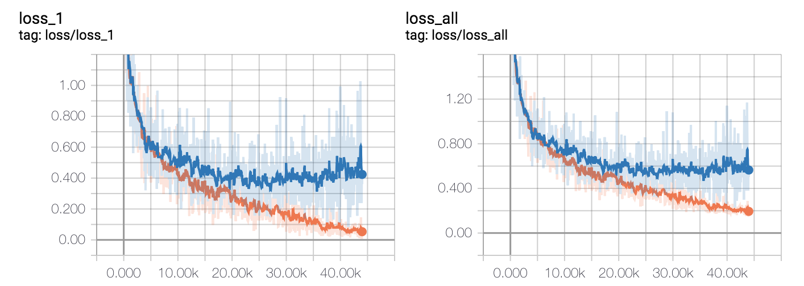

## About
Tensorflow implementation of [DenseNet](http://openaccess.thecvf.com/content_cvpr_2017/papers/Huang_Densely_Connected_Convolutional_CVPR_2017_paper.pdf), the prediction accuracy on 10,000 test images is **88.1%**(**paper: 93%**).

+ trained on cifar-10, k = 12, L = 40

## Branch
Adding regularization term, without dropout layer.

## Train 
> python train.py

## Test
> python predict.py

## Results

+ Accuracy

    

+ Learning rate

    
    
+ Loss 

    
   
## prediction on test set

```
on batch size: 100, test accuracy: 0.890000
on batch size: 100, test accuracy: 0.870000
on batch size: 100, test accuracy: 0.890000
on batch size: 100, test accuracy: 0.900000
on batch size: 100, test accuracy: 0.860000
on batch size: 100, test accuracy: 0.840000
on batch size: 100, test accuracy: 0.850000
on batch size: 100, test accuracy: 0.810000
on batch size: 100, test accuracy: 0.900000
on batch size: 100, test accuracy: 0.830000
on batch size: 100, test accuracy: 0.860000
on batch size: 100, test accuracy: 0.930000
on batch size: 100, test accuracy: 0.860000
on batch size: 100, test accuracy: 0.910000
on batch size: 100, test accuracy: 0.890000
on batch size: 100, test accuracy: 0.900000
on batch size: 100, test accuracy: 0.890000
on batch size: 100, test accuracy: 0.940000
on batch size: 100, test accuracy: 0.900000
on batch size: 100, test accuracy: 0.890000
on batch size: 100, test accuracy: 0.830000
on batch size: 100, test accuracy: 0.880000
on batch size: 100, test accuracy: 0.820000
on batch size: 100, test accuracy: 0.930000
on batch size: 100, test accuracy: 0.950000
on batch size: 100, test accuracy: 0.820000
on batch size: 100, test accuracy: 0.870000
on batch size: 100, test accuracy: 0.870000
on batch size: 100, test accuracy: 0.920000
on batch size: 100, test accuracy: 0.910000
on batch size: 100, test accuracy: 0.900000
on batch size: 100, test accuracy: 0.900000
on batch size: 100, test accuracy: 0.860000
on batch size: 100, test accuracy: 0.920000
on batch size: 100, test accuracy: 0.860000
on batch size: 100, test accuracy: 0.890000
on batch size: 100, test accuracy: 0.940000
on batch size: 100, test accuracy: 0.920000
on batch size: 100, test accuracy: 0.900000
on batch size: 100, test accuracy: 0.900000
on batch size: 100, test accuracy: 0.930000
on batch size: 100, test accuracy: 0.870000
on batch size: 100, test accuracy: 0.820000
on batch size: 100, test accuracy: 0.890000
on batch size: 100, test accuracy: 0.820000
on batch size: 100, test accuracy: 0.870000
on batch size: 100, test accuracy: 0.880000
on batch size: 100, test accuracy: 0.870000
on batch size: 100, test accuracy: 0.880000
on batch size: 100, test accuracy: 0.920000
on batch size: 100, test accuracy: 0.820000
on batch size: 100, test accuracy: 0.860000
on batch size: 100, test accuracy: 0.910000
on batch size: 100, test accuracy: 0.890000
on batch size: 100, test accuracy: 0.860000
on batch size: 100, test accuracy: 0.910000
on batch size: 100, test accuracy: 0.880000
on batch size: 100, test accuracy: 0.910000
on batch size: 100, test accuracy: 0.870000
on batch size: 100, test accuracy: 0.880000
on batch size: 100, test accuracy: 0.880000
on batch size: 100, test accuracy: 0.930000
on batch size: 100, test accuracy: 0.850000
on batch size: 100, test accuracy: 0.900000
on batch size: 100, test accuracy: 0.890000
on batch size: 100, test accuracy: 0.900000
on batch size: 100, test accuracy: 0.850000
on batch size: 100, test accuracy: 0.880000
on batch size: 100, test accuracy: 0.830000
on batch size: 100, test accuracy: 0.880000
on batch size: 100, test accuracy: 0.890000
on batch size: 100, test accuracy: 0.840000
on batch size: 100, test accuracy: 0.900000
on batch size: 100, test accuracy: 0.910000
on batch size: 100, test accuracy: 0.860000
on batch size: 100, test accuracy: 0.920000
on batch size: 100, test accuracy: 0.880000
on batch size: 100, test accuracy: 0.860000
on batch size: 100, test accuracy: 0.870000
on batch size: 100, test accuracy: 0.910000
on batch size: 100, test accuracy: 0.850000
on batch size: 100, test accuracy: 0.790000
on batch size: 100, test accuracy: 0.910000
on batch size: 100, test accuracy: 0.890000
on batch size: 100, test accuracy: 0.880000
on batch size: 100, test accuracy: 0.840000
on batch size: 100, test accuracy: 0.890000
on batch size: 100, test accuracy: 0.860000
on batch size: 100, test accuracy: 0.900000
on batch size: 100, test accuracy: 0.900000
on batch size: 100, test accuracy: 0.910000
on batch size: 100, test accuracy: 0.880000
on batch size: 100, test accuracy: 0.910000
on batch size: 100, test accuracy: 0.870000
on batch size: 100, test accuracy: 0.830000
on batch size: 100, test accuracy: 0.880000
on batch size: 100, test accuracy: 0.920000
on batch size: 100, test accuracy: 0.860000
on batch size: 100, test accuracy: 0.900000
on batch size: 100, test accuracy: 0.860000
The test set number is 10000, the average accuracy is 0.881000
```